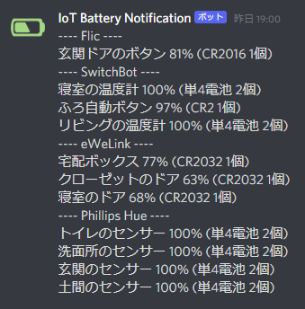

# iot-battery-notification

IoT機器からバッテリー残量を集計し、Webhookで通知する

## 対応機種
* [SONOFF SNZB-04 – ZigBee Wireless door/window sensor](https://itead.cc/product/sonoff-snzb-04-zigbee-wireless-door-window-sensor/)
* [Flic](https://flic.io/)
* [Philips Hue モーション センサー](https://www.philips-hue.com/ja-jp/p/hue-motion-sensor/8718696769881)
* [Philips Hue スマートボタン](https://www.philips-hue.com/ja-jp/p/hue-smart-button/8719514342682)
* [SwitchBot ボット](https://www.switchbot.jp/products/switchbot-bot)
* [SwitchBot 温湿度計](https://www.switchbot.jp/products/switchbot-meter)

## 初期設定
`.env.sample`をコピーし、`.env`にリネームする。

`.env`、`config/default.yml`に必要な情報を入力する。

`config/default.yml`を開き、`useTasks`の利用しないタスクをコメントアウトする。

SwitchBotタスクを利用する場合、下記コマンドを実行する必要があります。  
https://github.com/noble/noble#running-on-linuxsudo

## 実行方法
```bash
./execute.sh
```

## 活用例
crontabに登録し、1日1回バッテリー残量をDiscordに送信する


